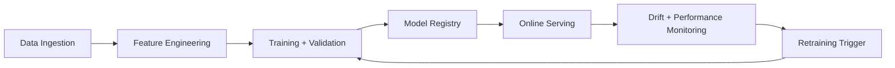

# AI, ML, Deep Learning, NLP, and Data Science Strategy

## 1. Objectives
- Improve portfolio decision quality with explainable models.
- Detect risk and market regime changes early.
- Support research enrichment and operator productivity.
- Keep models auditable and safe for financial workflows.

## 2. AI Capability Map

| Capability | Technique | Output |
| --- | --- | --- |
| Return forecasting | supervised learning / time-series models | expected return distribution |
| Risk forecasting | volatility and tail-risk models | VaR/CVaR and drawdown estimates |
| Portfolio allocation | optimization + policy learning | target weights under constraints |
| Research enrichment | NLP summarization/classification | note summaries, relevance, sentiment |
| Surveillance support | anomaly detection | suspicious activity flags |
| User explainability | rule + model attribution | human-readable rationale |

## 3. MLOps Lifecycle

## 4. Deep Learning and NLP Scope
- NLP for research notes and enterprise document indexing.
- Sequence models for multi-horizon return/risk forecasting where classical models underperform.
- Embedding models for semantic retrieval of research and support artifacts.

## 5. Data Science Standards
- Time-aware validation (walk-forward, no leakage).
- Benchmark against naive and statistical baselines.
- Uncertainty-aware output for risk-sensitive decisions.
- Bias and robustness checks across market regimes.

## 6. Neuroscience-Inspired Design (Applied Pragmatically)
- Model user risk behavior with bounded-rationality assumptions.
- Use cognitive-load-aware explanation templates (short, causal, action-oriented).
- Avoid overconfidence by always exposing uncertainty intervals.

## 7. Governance and Safety
- Human approval gate for execution remains mandatory.
- Model version and feature set attached to each proposal for auditability.
- Kill-switch and fallback policy for degraded model confidence.
- Separate experimental and production model tracks.

## 8. Data Architecture for AI
- Feature store (target) with point-in-time consistency.
- Model registry with lineage and approval status.
- Offline training dataset versioning.
- Online inference logging for drift and incident investigations.

## 9. KPIs
- Proposal acceptance rate with positive post-trade outcome.
- Forecast calibration error and drift metrics.
- False-positive rate in surveillance and alerting.
- Latency of inference path under market burst traffic.
