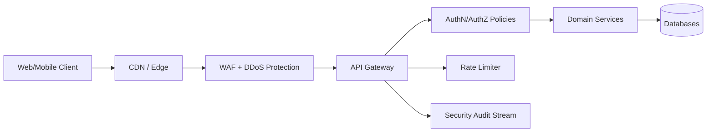

# API Design and Security

## 1. API Design Standards
- Use resource-oriented paths and nouns (`/api/v1/trade/proposals`).
- Use HTTP semantics correctly (`GET`, `POST`, `PUT`, `PATCH`, `DELETE`).
- Keep request/response contracts explicit and versioned.
- Enforce idempotency for retriable mutation endpoints.

## 2. Contract Conventions
- API version prefix: `/api/v1`.
- Pagination style: cursor-based where datasets can grow unbounded.
- Error format: stable envelope with machine code + human message + correlation ID.
- Time format: ISO-8601 UTC timestamps.

## 3. Security Control Plane

## 4. Authentication and Federation
- Primary: JWT bearer tokens issued by auth service.
- Enterprise federation:
  - OIDC Authorization Code + PKCE.
  - SAML 2.0 (signed assertions, audience and clock skew checks).
  - OIDC callback hardening: issuer/audience/nonce plus explicit expiry (`exp`), not-before (`nbf`),
    and issued-at (`iat`) boundary validation.
  - JWKS key selection hardening: choose usable RSA signing keys, prefer matching key identifiers when present,
    and fall back from malformed static cert configuration to JWKS discovery.
  - SAML callback hardening: strict `InResponseTo` enforcement when request IDs are tracked, required conditions
    validity windows, and rejection of malformed condition timestamps.
- Provisioning: SCIM 2.0 for user and membership lifecycle.

## 5. Authorization Model
- Layer 1: coarse role-based authorization (`OWNER`, `ADMIN`, `MEMBER`, `READ_ONLY`).
- Layer 2: org-scoped access checks using tenant context.
- Layer 3: operation-level policy checks (for trading, funding, admin exports).

## 6. API Security Baselines
- TLS 1.2+ required externally.
- HSTS on public endpoints.
- JWT expiration and refresh policy with token revocation support.
- Request size limits and schema validation at edge.
- Per-endpoint rate limits and abuse detection.
- Idempotency keys for money movement and order submissions.

## 7. Sensitive Operations
- Trade decision and execution submission.
- Banking transfers and funding withdrawals.
- SCIM token rotation and SSO config updates.
- Org admin audit export.

These operations require:
- Elevated role checks.
- Strong audit logging.
- Optional step-up authentication.

## 8. API Threat Model Checklist
- Broken object-level authorization (BOLA).
- Broken function-level authorization (BFLA).
- Token replay and token confusion.
- Input injection and unsafe deserialization.
- Excessive data exposure in list endpoints.
- Misconfigured CORS and open redirect in auth flows.

## 9. Testing and Verification
- Contract tests for auth and SCIM surfaces.
- Negative tests for cross-org access attempts.
- Replay and idempotency tests on transfer/order endpoints.
- Security scans (SAST, dependency, secret scanning) on every PR.

## 10. Security Performance Measures
- Auth latency p95 for token validation.
- Rate-limit trigger rate per endpoint class.
- 401/403 ratio by endpoint family.
- Suspicious token replay detections per day.
- Mean time to revoke compromised credential.

## 11. API Lifecycle Governance
- Introduce ADR for breaking API changes.
- Document deprecation windows and sunset dates.
- Publish changelog per endpoint family.
