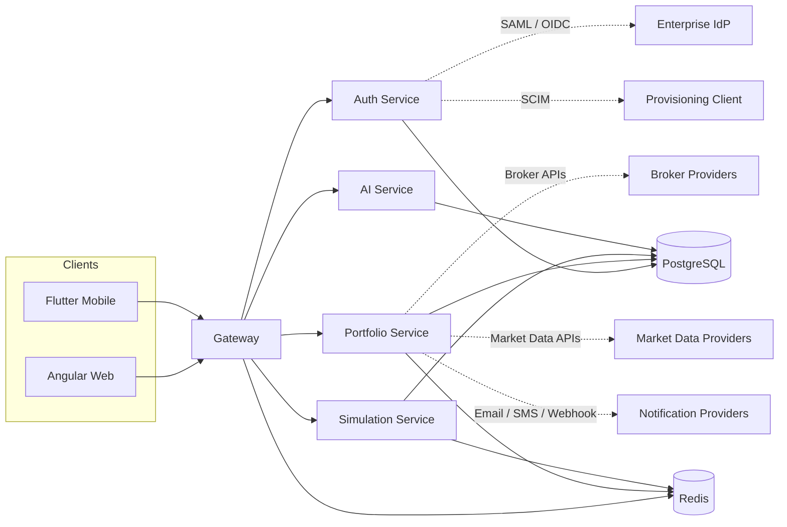
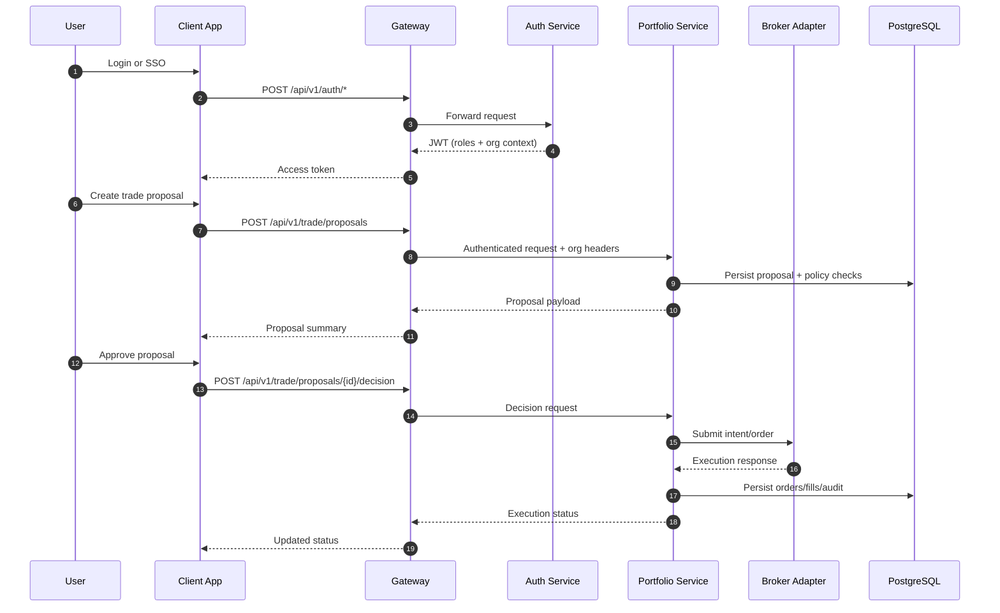

# Architecture

## System Overview
InvesteRei is a modular investing platform with service separation by responsibility:
- `gateway`: edge routing, JWT validation, rate limiting, identity header propagation.
- `auth-service`: identity lifecycle, org/membership management, MFA, SSO (SAML/OIDC), SCIM provisioning.
- `portfolio-service`: trading, risk, automation, reporting, research, rewards, compliance, market data policy.
- `simulation-service`: backtesting orchestration and persisted simulation results.
- `ai`: forecasting and model endpoints (proxied by gateway).
- `frontend/web`: Angular UI for operational and portfolio workflows.
- `mobile/investerei_app`: Flutter client with enterprise feature access.

## Component Graph

## Architectural Style
- Service-oriented architecture with API gateway at the edge.
- Domain-centric modules inside services (`application`, `domain`, `infrastructure`, `web`).
- Stateful persistence via PostgreSQL; low-latency cache/queue via Redis.
- Event/audit traceability through explicit audit tables.

## Core Quality Attributes
- **Security**: JWT + role propagation, MFA, org scoping, SCIM token hash verification.
- **Auditability**: write-side audit events for security and portfolio actions.
- **Reliability**: idempotent auto-invest runs, deterministic reconciliation and statement generation.
- **Extensibility**: provider abstraction for brokers, market data, notifications.

## Runtime Data Flow (Typical Trade Lifecycle)
1. User authenticates via local auth or enterprise SSO.
2. Gateway validates JWT and forwards user/org context headers.
3. Portfolio service generates trade proposal and policy checks.
4. User decision is recorded; execution intent is created and submitted.
5. Fill/order data updates account state and triggers surveillance/best-execution records.
6. Audit and notifications are written for traceability.

## Trade Lifecycle Sequence

## Org/Tenant Boundary
- Every org-scoped domain table includes `org_id`.
- Request trace filter resolves `X-Org-Id` into tenant context.
- Repositories/services apply user + org constraints on reads/writes.
- Org-admin reporting aggregates only current-tenant data.
