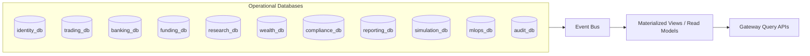

# Database Strategy and Database Design

## 1. Strategy Summary
Adopt a **database-per-capability** model for enterprise scale. Each major domain owns its schema and lifecycle. Cross-domain coordination is done through APIs and event contracts, not direct table joins across bounded contexts.

This aligns with your requirement that each major element (for example machines, requests, confirmations) can evolve independently.

## 2. Current vs Target

| Area | Current | Target |
| --- | --- | --- |
| Data ownership | Service-oriented but mostly PostgreSQL-centered | Explicit DB per capability/domain |
| Cross-domain data flow | Synchronous API calls | Event-driven + materialized read models |
| Schema evolution | Flyway per service | Flyway per capability DB, independent release cadence |
| Analytics/reporting | On operational tables | Dedicated reporting store fed by events |

## 3. Domain Database Catalog (Target)

| Database | Owns | Key Objects |
| --- | --- | --- |
| `identity_db` | Auth/organizations | users, orgs, memberships, SSO configs, SCIM state |
| `trading_db` | Proposal and decision lifecycle | proposals, orders, intents, fills |
| `banking_db` | Internal banking cash movement | banking accounts, transfers |
| `funding_db` | External money movement | funding sources, deposits, withdrawals |
| `research_db` | Research and screener data | coverage, notes, screener snapshots |
| `wealth_db` | Goal planning and simulations | plans, simulation runs, assumptions |
| `compliance_db` | Controls and surveillance | profiles, alerts, best-execution records |
| `reporting_db` | Statements and reconciliations | ledger, tax lots, statements, reconciliation results |
| `simulation_db` | Backtest jobs and quotas | jobs, configs, worker state, user quota |
| `mlops_db` | Model registry and inference metadata | models, versions, drift, feature stats |
| `audit_db` | Immutable enterprise audit | security events, policy events, transfer/trade events |

## 4. Machine/Request/Confirmation Pattern
When a workflow has machine-triggered operations:
- `machine_db` keeps machine state and health.
- `request_db` stores submitted commands/requests.
- `confirmation_db` stores acknowledgement and settlement state.

The same pattern is applied in trading:
- Intent = request.
- Broker acknowledgment/fill = confirmation.

## 5. Data Topology

## 6. Consistency Model
- Strong consistency inside each database transaction boundary.
- Eventual consistency across domains.
- Idempotent consumers and deduplication keys required.
- Outbox table per domain used for reliable event publish.

## 7. Data Integrity and Governance
- Every mutable table includes `created_at` and `updated_at`.
- Every org-scoped table includes `org_id` and index on `(org_id, id)`.
- Soft-delete for user- or compliance-sensitive records where recovery/audit is needed.
- Hash-chain or signed events for critical audit trails.

## 8. Availability and Recovery
- Multi-AZ deployment for production databases.
- PITR backups for operational stores.
- RPO targets:
  - `audit_db`, `trading_db`, `banking_db`: <= 5 minutes.
  - others: <= 15 minutes.
- RTO targets:
  - critical stores: <= 30 minutes.
  - secondary stores: <= 2 hours.

## 9. Migration Rules
- No destructive migration without compatibility window.
- Deploy additive schema first, then code, then cleanup migration.
- Validate all migrations in CI against previous N release snapshots.
