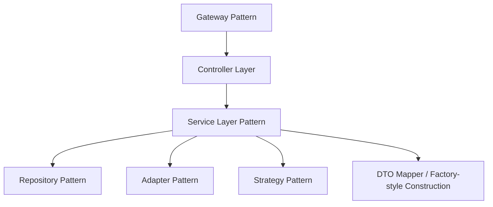

# Design Patterns

## Patterns in Use
- **Gateway Pattern**: central API entry point for auth, routing, and policy enforcement.
- **Repository Pattern**: JPA repositories abstract persistence access.
- **Service Layer Pattern**: application services encapsulate business workflows.
- **Adapter Pattern**: broker, market data, and notification provider integrations.
- **Strategy Pattern**: provider routing and execution mode selections.
- **Factory-style Construction**: request-to-entity assembly for deterministic writes.
- **DTO Mapper Pattern**: explicit conversion methods to avoid leaking persistence shapes.

## Pattern Placement

## Why These Patterns
- Improve maintainability as features grow across enterprise modules.
- Keep integration logic isolated from core domain logic.
- Simplify testing by narrowing unit responsibilities.

## Pattern Boundaries
- Do not place domain policy in controllers or repositories.
- Keep provider-specific logic behind adapter interfaces.
- Use tenant context consistently across all service-level workflows.
