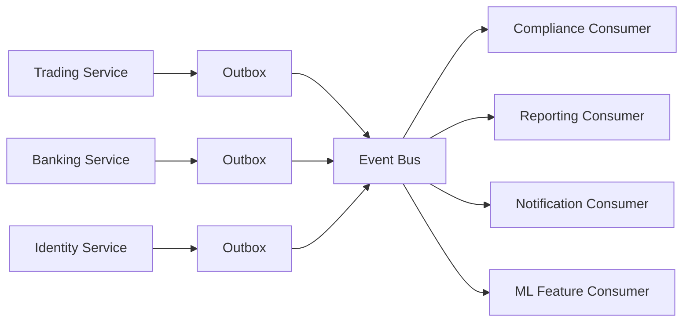

# Distributed System Design and Event-Driven Architecture

## 1. Distributed Design Principles
- Service autonomy with explicit contracts.
- Local transactions within a service; eventual consistency across services.
- Idempotent command handling and replay-safe consumers.
- Fail-fast at boundaries with retries and dead-letter handling.

## 2. Event-Driven Topology

## 3. Core Event Contracts (Target)
- `trade.proposal.created`
- `trade.proposal.approved`
- `trade.intent.submitted`
- `trade.fill.confirmed`
- `banking.transfer.completed`
- `identity.membership.changed`
- `wealth.plan.run.completed`

## 4. Workflow Orchestration
- Choreography for low-coupling event propagation.
- Saga orchestration for critical multi-step financial workflows.
- Compensation examples:
  - Transfer reserved but order failed -> reverse reservation.
  - External funding posted but settlement failed -> hold and manual review.

## 5. Consistency and Availability Choices
- Strong consistency for in-domain money and order transitions.
- Eventual consistency for read models and cross-domain dashboards.
- Prioritize availability for quote/research read paths.
- Prioritize consistency for transfer and execution writes.

## 6. Failure Handling
- Retry with exponential backoff and jitter.
- Dead-letter queues for poison messages.
- Idempotency keys and unique constraints on side-effecting handlers.
- Operator runbooks for replay and compensation.

## 7. Reliability Pattern Map

| Problem | Pattern |
| --- | --- |
| Lost event after DB commit | Transactional outbox |
| Duplicate delivery | Idempotent consumer + dedup store |
| Cross-service transaction | Saga + compensation |
| Slow dependency | Circuit breaker + timeout + fallback |
| Read scale | CQRS read model |

## 8. Observability in Distributed Flows
- Correlation ID propagated through gateway and events.
- Trace spans for API, queue publish, queue consume, and DB writes.
- Per-topic lag, retry, and DLQ metrics.
