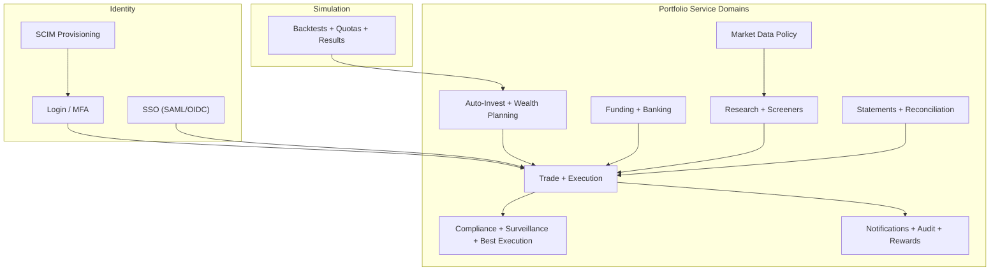
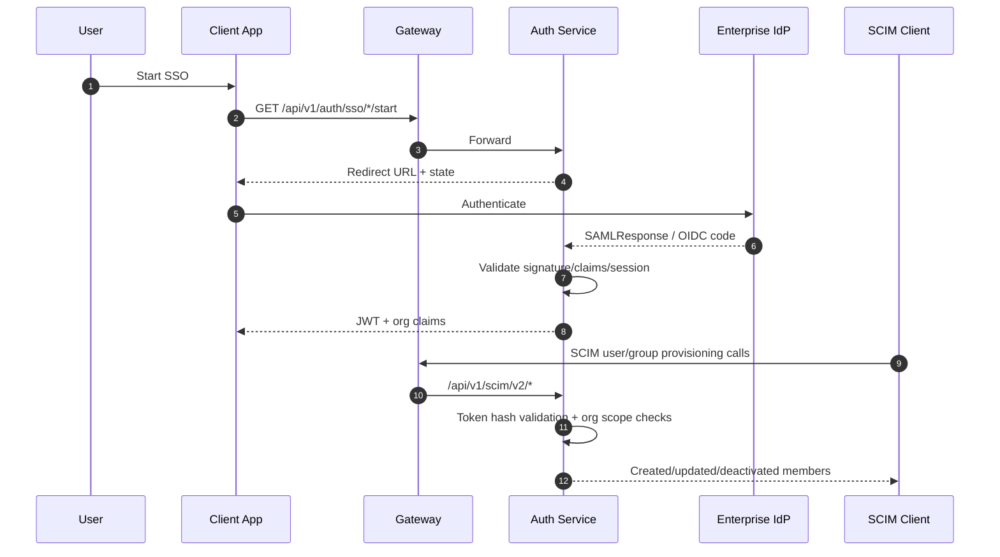

# High-Level Design (HLD)

## Logical Components
- **Client Layer**: Angular web + Flutter mobile.
- **Edge Layer**: Spring Cloud Gateway, auth guard, rate limiter.
- **Identity Layer**: Auth service (login/register, MFA, orgs, SSO, SCIM).
- **Portfolio Domain Layer**: Portfolio service bounded contexts:
  - Trade + execution
  - Auto-invest + wealth planning
  - Funding + banking
  - Research + screeners + market data policy
  - Reporting + reconciliation + statements
  - Compliance + surveillance + best execution
  - Rewards + notifications + audit
- **Simulation Layer**: Async backtest jobs/results.
- **Data Layer**: PostgreSQL + Redis.

## Domain Capability Map

## External Integrations
- Broker adapters (account/order/position sync).
- Market data providers (quotes/history/backfill).
- Notification providers (email/webhook/SMS/push abstractions).
- Enterprise IdPs via SAML/OIDC and provisioning via SCIM.

## Key Interfaces
- REST API under `/api/v1/**` exposed through gateway.
- Tokenized auth boundary with propagated claims:
  - `X-User-Id`, `X-User-Roles`, `X-Org-Id`, `X-Org-Roles`, `X-User-Mfa`.

## Critical Workflows
- **Enterprise access**: SSO login -> federation mapping -> org membership check -> JWT issue.
- **Provisioning**: SCIM token auth -> create/update/deactivate users and memberships.
- **Automated investing**: scheduled plan run -> optimization -> proposal -> optional execution.
- **Org reporting**: admin endpoints aggregate counts, balances, and recent audit events.

## Enterprise Identity Flow

## Deployment Topology
- Containerized services orchestrated with Docker Compose for local stack.
- Independent horizontal scaling possible per service based on workload profile.
