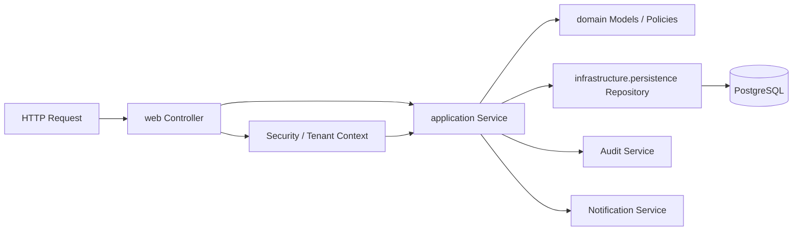
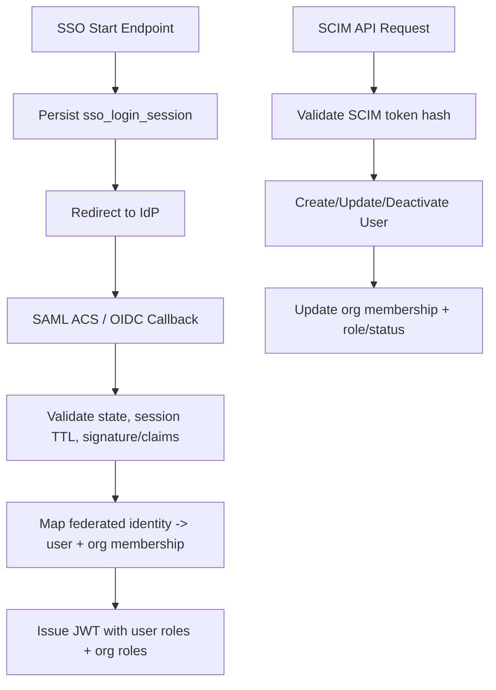
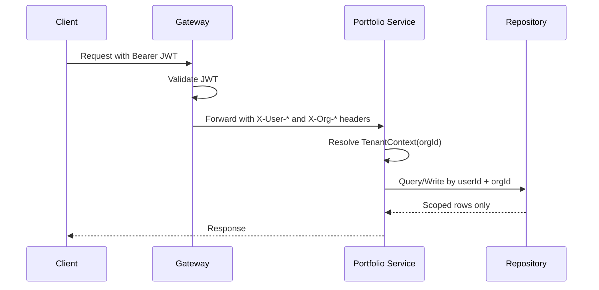

# Low-Level Design (LLD)

## Backend Package Structure
Each Spring service follows a layered package model:
- `web`: REST controllers, request/response mapping.
- `application`: use-case services and orchestration.
- `domain`: business models and enums.
- `infrastructure.persistence`: JPA entities and repositories.
- `security` / `web filters`: auth/tenant context helpers.

## Internal Layer Interaction

## Persistence Conventions
- UUID string IDs for most domain records.
- `createdAt` and `updatedAt` timestamps on mutable records.
- Explicit `orgId` for multi-tenant boundaries where applicable.
- Flyway migrations under `src/main/resources/db/migration`.

## Auth/Identity Internals
- SSO flows managed via `SsoService`:
  - OIDC: PKCE, nonce/state validation, token exchange, claim verification.
  - SAML: request/response session mapping, signature and audience checks.
- SCIM endpoints under `/api/v1/scim/v2` with bearer token hashing.

## Auth-Service SSO/SCIM Flow Detail

## Portfolio-Service Internals
- Repositories expose user+org query methods where org scoping is required.
- Services validate ownership and tenant boundary before updates.
- Admin reporting service aggregates repository metrics by `orgId`.

## API Design Rules
- Use clear resource-oriented endpoints and HTTP status semantics.
- Return validation errors as `400` and authorization failures as `403`.
- Keep DTOs stable and append-only for compatibility where possible.

## Mobile/Web Client Integration
- Clients use token store + bearer auth on all protected endpoints.
- UI actions map directly to gateway routes; backend enforces authz/scoping.

## Org-Scoped Read/Write Guard

