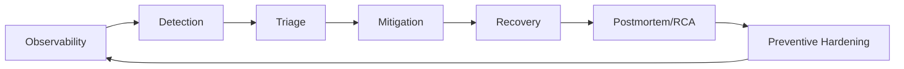

# Software Maintenance and Reliability

## 1. Objectives
- Keep the platform consistent, available, reliable, and maintainable at enterprise scale.
- Minimize incident blast radius and recovery time.

## 2. Reliability Model
- Consistency: strict for financial writes, eventual for analytics/read models.
- Availability: prioritize read path continuity for client UX.
- Reliability: idempotent workflows and deterministic replay.
- Maintainability: modular code, migration discipline, documented runbooks.

## 3. Operational Lifecycle

## 4. Maintenance Activities
- Schema maintenance and compaction policies.
- Index review for high-volume tenant queries.
- Dependency upgrade and CVE patch cadence.
- Capacity planning for gateway, DB, and workers.
- Chaos and failure-injection drills (target maturity).

## 5. Availability and DR Targets
- API gateway SLO: 99.9% monthly.
- Critical write-path RTO: <= 30 minutes.
- Critical write-path RPO: <= 5 minutes.
- Quarterly disaster recovery rehearsal.

## 6. Consistency Guardrails
- Money movement and execution state changes remain transactional.
- Use immutable event logs for post-trade reconstruction.
- Use reconciliation jobs to detect and repair drift.

## 7. Maintainability Indicators
- Time to implement medium change.
- Refactor debt backlog size.
- Module coupling trend.
- Documentation freshness score (updated within release window).

## 8. Runbook Minimums
- Auth outage response.
- Broker adapter degradation response.
- Banking transfer mismatch response.
- Queue lag / worker saturation response.
- Incident communication templates.
