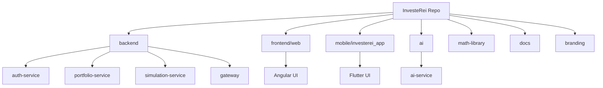

# Project Structure

## Repository Layout

| Path | Purpose |
| --- | --- |
| `backend/auth-service` | Authentication, MFA, organizations, SSO, SCIM provisioning |
| `backend/portfolio-service` | Trading, execution, funding, banking, research, reporting, compliance |
| `backend/simulation-service` | Backtest jobs, quotas, capacity tracking |
| `backend/gateway` | API edge routing, token validation, request context propagation |
| `backend/common` | Shared backend components |
| `ai/ai-service` | Forecasting and model endpoints |
| `ai/training` | Model training and experiment assets |
| `frontend/web` | Angular web application |
| `mobile/investerei_app` | Flutter mobile application |
| `math-library` | Quant formulas, ingestion helpers, plugin registry |
| `data/market` | Market data files and seeds |
| `docs` | Architecture, design, roadmap, quality, operations docs |
| `branding` | README/social visual assets |

## Service Internal Layout (Java Services)
- `web`: API controllers and transport DTO mappings.
- `application`: use-case orchestration and workflow services.
- `domain`: domain models and policy abstractions.
- `infrastructure.persistence`: entities, repositories, schema interactions.
- `security` / filters: auth, claims, tenant context.

## Project Map

## Build and Run Boundaries
- Backend modules are Maven projects with service-local Flyway migrations.
- Frontend uses Node/npm build flow.
- Mobile uses Flutter SDK build flow.
- Local orchestration is driven by `docker-compose.yml` and `Makefile`.

## Ownership and Change Guidance
- Keep each domain change in the owning service first.
- Avoid cross-service shared database writes.
- Add migration files with each persistence change.
- Update docs index when new docs are introduced.
