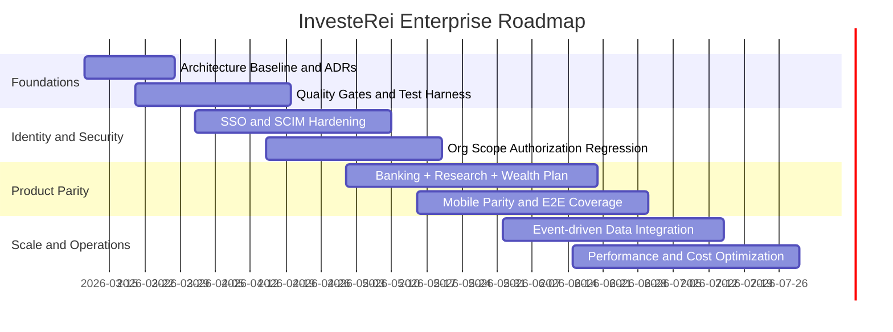

# Open Source Roadmap

This roadmap aligns product parity work, enterprise hardening, and open-source delivery quality.

## Release Streams
- Stream A: Core platform reliability and security.
- Stream B: Enterprise identity and org governance.
- Stream C: Banking + investing parity features.
- Stream D: Developer experience, docs, and quality automation.

## Timeline

## Milestone Backlog

### M1: Engineering Baseline
- Complete architecture, HLD, LLD, UML, and requirements documentation.
- Define API governance and schema migration standards.
- Introduce CI gates for backend build and frontend/mobile build checks.

### M2: Enterprise Security and Identity
- Complete OIDC/SAML edge-case coverage.
- Complete SCIM create/update/deactivate + group membership tests.
- Add tenant isolation security matrix to CI.

### M3: Product Completion
- Harden trade lifecycle and proposal decision flows.
- Complete banking instant transfer and wealth plan reliability tests.
- Ensure mobile parity for all critical enterprise screens.

### M4: Scalability and Operations
- Introduce event contracts and outbox-based propagation.
- Add observability SLOs, runbooks, and incident management workflows.
- Add cost-aware scaling policies and benchmark suite.

## Delivery Governance
- Every milestone requires a release readiness review.
- Every major architecture change requires an ADR.
- Every critical endpoint requires contract + authorization tests.

## Existing Public Tracking
Live milestone/issues mapping remains in GitHub issues for `reiidoda/InvesteRei`.
