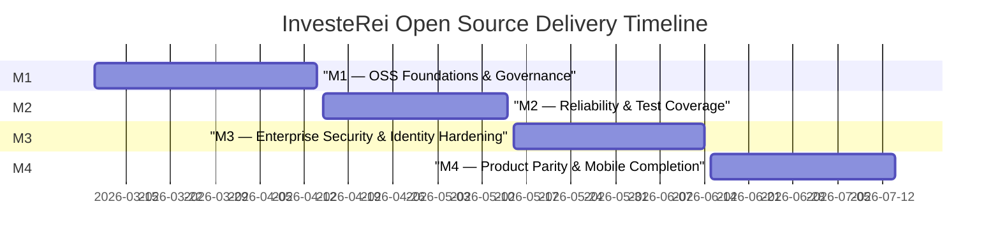
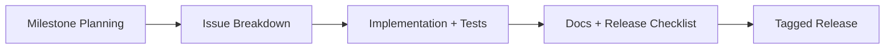

# Open Source Roadmap

This roadmap is backed by live GitHub milestones and issues in `reiidoda/InvesteRei`.

## Milestone Timeline

## Milestones and Issues

### M1 — OSS Foundations & Governance
- [#1 Define required CI checks and branch protection policy](https://github.com/reiidoda/InvesteRei/issues/1)
- [#2 Add standardized issue/PR templates and triage workflow](https://github.com/reiidoda/InvesteRei/issues/2)
- [#3 Introduce ADR process for architecture changes](https://github.com/reiidoda/InvesteRei/issues/3)

### M2 — Reliability & Test Coverage
- [#4 Add org-scope repository/service regression tests](https://github.com/reiidoda/InvesteRei/issues/4)
- [#5 Add API contract tests for SSO and SCIM flows](https://github.com/reiidoda/InvesteRei/issues/5)
- [#6 Add end-to-end gateway smoke test suite](https://github.com/reiidoda/InvesteRei/issues/6)

### M3 — Enterprise Security & Identity Hardening
- [#7 Harden SSO assertion/token validation edge cases](https://github.com/reiidoda/InvesteRei/issues/7)
- [#8 Audit org-role authorization consistency on admin APIs](https://github.com/reiidoda/InvesteRei/issues/8)
- [#9 Implement tenant isolation security regression matrix](https://github.com/reiidoda/InvesteRei/issues/9)

### M4 — Product Parity & Mobile Completion
- [#10 Complete mobile enterprise module UX parity](https://github.com/reiidoda/InvesteRei/issues/10)
- [#11 Add mobile integration tests for critical workflows](https://github.com/reiidoda/InvesteRei/issues/11)
- [#12 Prepare release readiness checklist and vNext acceptance criteria](https://github.com/reiidoda/InvesteRei/issues/12)

## Delivery Flow

## Definition of Done
- Code merged with passing required checks.
- Tests and docs updated.
- Security and tenant-scope regressions covered.
- Release notes include milestone/issue traceability.
