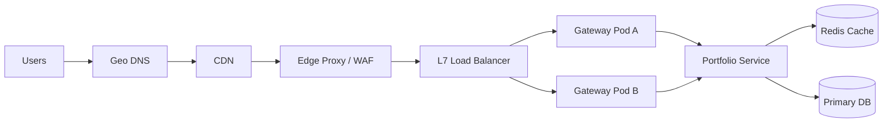

# Scalability, Load Balancing, and Performance

## 1. Scalability Goals
- Support horizontal scale for API and compute-heavy services.
- Keep user-facing latency predictable during market spikes.
- Scale read-heavy traffic without linear database growth.

## 2. Traffic and Edge Architecture

## 3. Load Balancing Strategy
- External: L7 load balancing by path and health status.
- Internal: service-level round-robin with circuit breakers.
- Sticky sessions are avoided; token-based stateless auth preferred.
- Autoscale gateway and portfolio service by CPU + request rate.

## 4. Caching Strategy
- Edge cache (CDN): static assets and public metadata.
- Application cache (Redis): latest quotes, hot reference data, throttling counters.
- Database cache/indexing: selective indexes for tenant-scoped queries.

## 5. Latency Budget (Initial Targets)

| Endpoint Class | p50 | p95 | p99 |
| --- | --- | --- | --- |
| Auth and profile | <= 120 ms | <= 250 ms | <= 500 ms |
| Read-only market/research | <= 100 ms | <= 220 ms | <= 450 ms |
| Trade proposal and decision | <= 180 ms | <= 350 ms | <= 700 ms |
| Banking transfer confirm | <= 200 ms | <= 400 ms | <= 800 ms |
| Simulation submit/status | <= 220 ms | <= 500 ms | <= 1000 ms |

## 6. Throughput and Capacity
- Target sustained API throughput: 2k+ RPS at gateway baseline.
- Burst tolerance: 5k RPS for 5-minute intervals.
- Simulation worker capacity controlled via queue depth and concurrency caps.

## 7. Protocols, Proxies, and WebSockets
- External API protocol: HTTPS over HTTP/1.1 or HTTP/2.
- Service-to-service: HTTP/2 or gRPC (target for high-volume internal calls).
- WebSockets/SSE (target): real-time quote updates and job progress streaming.
- Reverse proxies terminate TLS and enforce edge policies.

## 8. Performance and Security Co-Design
- Rate limiting and WAF rules tuned to avoid false positives on market bursts.
- JWT validation cached with short TTL to reduce auth overhead.
- Sensitive endpoints use stricter rate classes and anomaly detection.

## 9. Cost and Performance Optimization
- Separate compute pools for synchronous APIs and background workers.
- Right-size DB instances by workload class.
- Move heavy analytical reads to reporting replicas.
- Use storage lifecycle policies for older market/simulation datasets.

## 10. Benchmark Plan
- Baseline with representative user and market traffic.
- Execute load, stress, and soak scenarios per release.
- Track regression thresholds in CI/CD performance gates.
