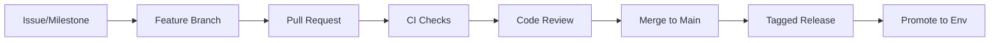

# Software Configuration Management (SCM)

## 1. Scope
SCM governs source control, branching, versioning, release promotion, and environment configuration.

## 2. Branching and Change Flow
- `main`: protected integration branch.
- `codex/*`: assistant-generated task branches.
- `feature/*`: product development branches.
- `release/*`: stabilization branches.
- `hotfix/*`: emergency fixes from production tags.

## 3. Pull Request Rules
- At least one reviewer approval.
- Required checks must pass.
- No direct pushes to protected branches.
- Link PR to issue/milestone where applicable.
- For explicit required checks and branch protection payload, see `docs/CI_BRANCH_PROTECTION_POLICY.md`.

## 3.1 Issue Intake and Triage
- Use standardized GitHub issue templates for bug, feature, and engineering task intake.
- Every issue must be classifiable by type, area, priority, and owner during intake.
- Triage states, SLA targets, ownership rules, and milestone assignment rules are defined in `docs/TRIAGE_WORKFLOW.md`.

## 4. Commit and Versioning
- Use structured commit messages (`feat`, `fix`, `docs`, `refactor`, `test`, `chore`).
- Adopt semantic versioning (`MAJOR.MINOR.PATCH`).
- Tag releases and publish release notes with migration notes.
- Release notes must include latest gateway smoke suite result (`PASS/FAIL` + run reference) per `docs/GATEWAY_SMOKE_SUITE.md`.

## 5. Configuration Management
- Environment variables are source-of-truth for deploy-time settings.
- No secrets in source control.
- Keep environment overlays for `dev`, `staging`, `prod`.
- Document default values and required secrets per service.

## 6. SCM Flow

## 7. Artifact and Dependency Controls
- Lock dependency versions for deterministic builds.
- Generate SBOMs for release artifacts.
- Run dependency vulnerability scanning in CI.

## 8. Change Auditability
- All production changes traceable to PR and tag.
- Migration scripts versioned with service code.
- Incident fixes include postmortem and preventive action item.

## 9. Policy Versioning
- CI quality gate policy is versioned in `docs/CI_BRANCH_PROTECTION_POLICY.md`.
- Branch protection JSON for `main` is versioned in `.github/branch-protection/main.json`.
- Any required-check change must update policy version and branch-protection config in the same PR.

## 10. ADR Governance
- ADR process and conventions are defined in `docs/adr/README.md`.
- Every major architecture change must include a new ADR or explicitly supersede an existing ADR.
- ADR updates must be linked from the implementing PR and related issue.
