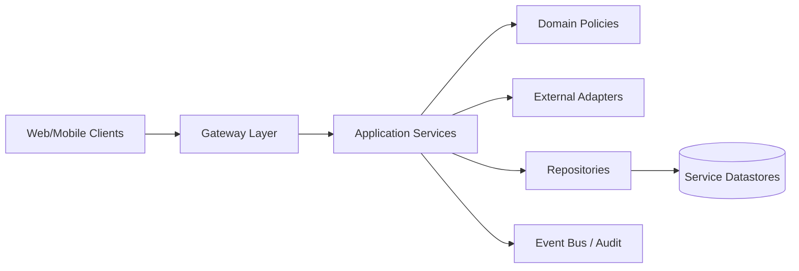

# Software Design

## Design Principles
- Domain-driven decomposition by capability (identity, portfolio, simulation, AI).
- Explicit boundaries between transport, orchestration, policy, and persistence.
- Composition over inheritance in service orchestration.
- Stable contracts at API boundaries with additive evolution.
- Security and tenancy as first-class cross-cutting concerns.

## Design Layers

## Object-Oriented Design
- Controller classes expose only transport concerns.
- Service classes encode business workflows and invariants.
- Repository interfaces hide persistence mechanics.
- Adapters isolate broker, market data, notification, and IdP integration specifics.

See also:
- `docs/OO_DESIGN.md`
- `docs/DESIGN_PATTERNS.md`

## Pattern Selection
- Gateway Pattern: centralized auth and routing controls.
- Repository Pattern: persistence abstraction and testability.
- Strategy Pattern: broker/provider selection and routing logic.
- Adapter Pattern: external integration isolation.
- Outbox Pattern (target): reliable event publication from write transactions.
- Saga Pattern (target): multi-service workflows with compensation.

## Decision Matrix

| Concern | Current State | Target Direction |
| --- | --- | --- |
| Service boundaries | Modular services | Keep boundaries strict, reduce cross-domain coupling |
| Persistence isolation | Shared PostgreSQL per runtime | Per-capability service databases with event contracts |
| Cross-service communication | REST + shared context headers | REST for queries + event-driven integration for state propagation |
| Real-time updates | Pull APIs | Add WebSocket/event streaming for quote and job status |

## Design Review Checklist
- Does the change preserve org-scoped data isolation?
- Are all side effects auditable?
- Is the API contract backward-compatible?
- Are idempotency and retry behavior explicit?
- Are failure/timeout paths handled with deterministic outcomes?
