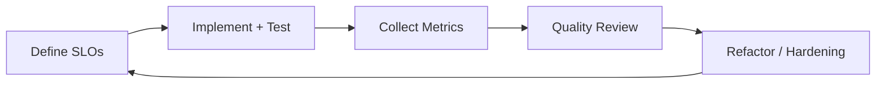

# Software Quality and Metrics

## 1. Quality Model
Quality is measured across correctness, security, reliability, performance, and maintainability.

## 2. Metric Framework

| Dimension | Metric | Target |
| --- | --- | --- |
| Delivery | Deployment frequency | >= weekly |
| Delivery | Lead time for change | <= 2 days median |
| Stability | Change failure rate | <= 10% |
| Stability | MTTR | <= 2 hours |
| Reliability | API availability | >= 99.9% monthly |
| Reliability | Error budget burn | <= 1x budget/month |
| Security | Critical vuln open time | <= 7 days |
| Security | High vuln open time | <= 30 days |
| Quality | Defect escape rate | <= 5% per release |
| Testing | Critical path coverage | >= 90% |
| Maintainability | PR cycle time | <= 48h median |

## 3. SLI/SLO Structure
- SLI-API-Availability: successful requests / total requests.
- SLI-API-Latency: p95 latency by endpoint class.
- SLI-Queue-Lag: consumer lag per event topic.
- SLI-Data-Freshness: time from source event to read-model visibility.

## 4. Quality Control Loop

## 5. Release Quality Gates
- All required checks green.
- No open critical security findings.
- Error budget not exhausted.
- Performance baseline within tolerance.
- Release notes and migration notes published.

## 6. Reporting Cadence
- Daily: CI health, failed tests, incident alerts.
- Weekly: DORA metrics, defect trends, vulnerability aging.
- Monthly: SLO review, architecture debt register, roadmap adjustments.
