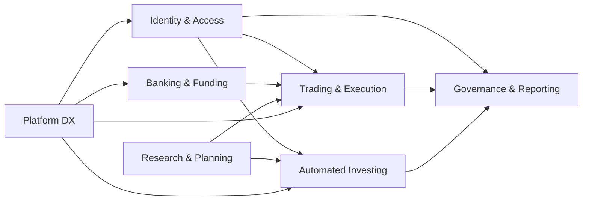

# Software Requirements

## 1. Scope
InvesteRei is an enterprise investing platform with three product surfaces:
- Self-directed investing (DIY trading and research).
- Automated investing (goal-based portfolios and rebalancing).
- Bank-integrated funding and treasury workflows.

The system must support both retail-like journeys and organization-scoped enterprise controls.

## 2. Stakeholders
- End investors (web/mobile users).
- Organization admins (tenant governance, reporting, access control).
- Operations and support teams.
- Security and compliance teams.
- Quant/AI teams.

## 3. Functional Requirements

### FR-100 Identity and Access
- FR-101: Support email/password login and MFA challenge flow.
- FR-102: Support enterprise SSO with OIDC and SAML.
- FR-103: Support SCIM provisioning (create, update, deactivate users and memberships).
- FR-104: Enforce org-scoped authorization on all protected endpoints.

### FR-200 Trading and Execution
- FR-201: Create and evaluate trade proposals before execution.
- FR-202: Require explicit user decision (approve/decline) for proposal execution.
- FR-203: Create execution intents and submit through broker adapters.
- FR-204: Persist orders, fills, and execution audit events.

### FR-300 Automated Investing
- FR-301: Create goal-based automated plans.
- FR-302: Run scheduled allocations and rebalance according to target risk.
- FR-303: Enforce minimum balance for automated plans (default: 500 USD).
- FR-304: Charge advisory fee (default: 0.35% annualized, charged quarterly).

### FR-400 Banking and Funding
- FR-401: Maintain banking cash account per user and org context.
- FR-402: Support instant internal transfer between banking and investing balances.
- FR-403: Support external funding sources, deposits, withdrawals, and transfer audit trail.

### FR-500 Research and Decision Support
- FR-501: Provide proprietary-style research coverage (rating, target, focus list).
- FR-502: Provide security screener APIs with fundamentals and research filters.
- FR-503: Provide portfolio builder diagnostics for diversification and concentration.
- FR-504: Provide wealth planning simulation with probability of success.

### FR-600 Governance, Compliance, and Reporting
- FR-601: Record tamper-evident audit events.
- FR-602: Run surveillance and best-execution checks.
- FR-603: Provide organization admin summary and scoped audit reporting.
- FR-604: Provide statement, tax lot, corporate action, and reconciliation workflows.

### FR-700 Platform and Developer Experience
- FR-701: Expose all core capabilities through `/api/v1/**` contract.
- FR-702: Provide web and mobile clients aligned to same backend APIs.
- FR-703: Support local development with containerized stack.

## 4. Non-Functional Requirements
- NFR-101 Security: MFA, JWT claims validation, tenant isolation, least privilege.
- NFR-102 Availability: 99.9% monthly availability for public API gateway.
- NFR-103 Reliability: idempotent job execution and replay-safe event processing.
- NFR-104 Performance: p95 read APIs under 300 ms for cached and index-backed endpoints.
- NFR-105 Scalability: horizontal scaling for gateway, portfolio, simulation workers.
- NFR-106 Maintainability: modular service boundaries and migration-based schema control.
- NFR-107 Observability: metrics, structured logs, audit correlation IDs.
- NFR-108 Compliance readiness: evidence retention for auth, trading, and admin actions.

## 5. Constraints and Assumptions
- Current implementation uses PostgreSQL and Redis in local compose topology.
- External broker and market data integrations require credentials and legal contracts.
- Tenant isolation is mandatory for enterprise mode.

## 6. Requirements Traceability

| Requirement Group | Primary Service(s) | Primary API Surface | Main Data Domain |
| --- | --- | --- | --- |
| FR-100 | `auth-service`, `gateway` | `/api/v1/auth/**`, `/api/v1/scim/v2/**` | users, orgs, federation |
| FR-200 | `portfolio-service` | `/api/v1/trade/**`, `/api/v1/execution/**` | proposals, intents, orders, fills |
| FR-300 | `portfolio-service` | `/api/v1/auto-invest/**`, `/api/v1/wealth/plan/**` | plans, runs, fees |
| FR-400 | `portfolio-service` | `/api/v1/banking/**`, `/api/v1/funding/**` | banking, transfers, funding |
| FR-500 | `portfolio-service`, `ai-service` | `/api/v1/research/**`, `/api/v1/screeners/**` | research, screeners, simulations |
| FR-600 | `portfolio-service` | `/api/v1/admin/org/**`, `/api/v1/audit/**`, `/api/v1/statements/**` | audit, compliance, reporting |
| FR-700 | all services | `/api/v1/**` via gateway | platform integration |

## 7. Requirement Dependency Graph

## 8. Definition of Done for New Features
- Requirement ID is mapped to API, schema migration, and tests.
- Org-scope and role checks are enforced.
- Audit events are emitted for security-sensitive operations.
- Docs and changelog are updated.
