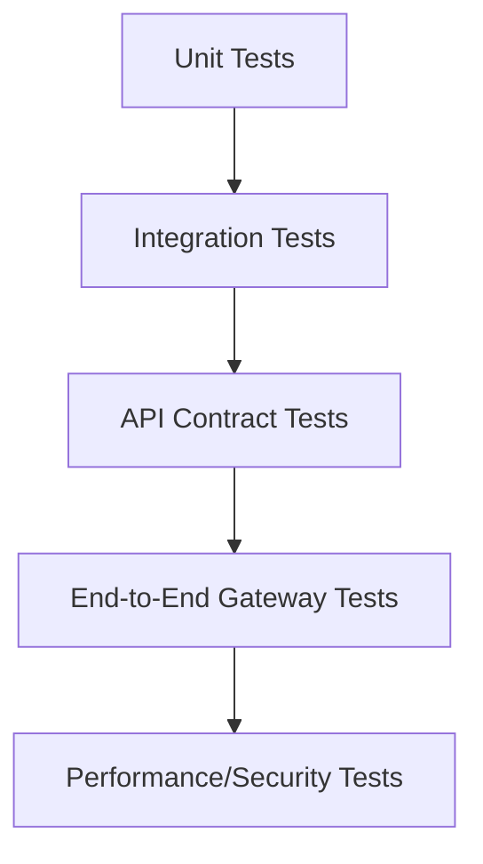
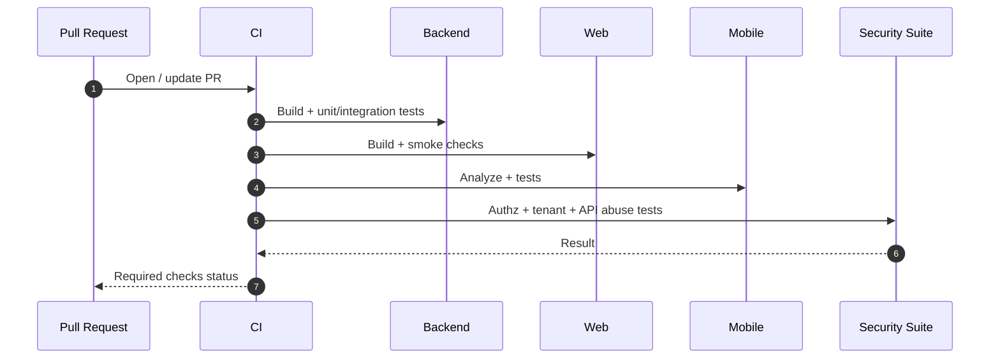

# Testing Strategy

## 1. Test Objectives
- Prove correctness of financial workflows and tenant boundaries.
- Prevent authz regressions in enterprise org-scoped APIs.
- Validate data integrity across trading, banking, and reporting domains.
- Gate releases with measurable quality criteria.

## 2. Test Pyramid

## 3. Layered Strategy

### Unit Tests
- Domain policies, calculators, fee logic, validation rules.
- Service-level decision logic (approval, limits, role checks).

### Integration Tests
- Repository behavior with org/user scoping.
- Flyway migration compatibility and rollback checks.
- Redis cache and queue interactions (where applicable).

### API Contract Tests
- Auth login/MFA/SSO/SCIM.
- Trading proposal -> decision -> execution intent.
- Banking transfer atomicity and balance invariants.
- Wealth plan simulation contract and constraints.

### End-to-End Tests
- Cross-service flow through gateway on dockerized stack.
- Critical user journeys on web and mobile clients.
- Gateway smoke script is versioned at `scripts/smoke/gateway_e2e_smoke.sh` (local + CI runnable).

### Non-Functional Tests
- Load test on read-heavy market and reporting APIs.
- Soak test for scheduler and simulation workers.
- Security tests: broken auth, token replay, tenant escape, rate-limit bypass.

## 4. Minimum Release Gates
- Gate 1: Backend modules build and pass tests.
- Gate 2: Web build passes and smoke tests run.
- Gate 3: Mobile analyze/test pass.
- Gate 4: Tenant isolation regression suite passes.
- Gate 5: Security regression suite passes.

Branch protection and required check contexts for these gates are versioned in `docs/CI_BRANCH_PROTECTION_POLICY.md`.
Gate 4 tenant-isolation suite definition and evidence mapping are versioned in
`docs/TENANT_ISOLATION_MATRIX.md` and executed by `scripts/ci/tenant_isolation_matrix.sh`.

## 5. Coverage Targets
- Domain and application service lines: >= 80%.
- Critical paths (auth, trade decision, transfer, fee charge): >= 90% branch coverage.
- Contract test coverage: all `/api/v1` critical business endpoints.

## 6. Test Data Strategy
- Seed deterministic fixtures for users, orgs, accounts, plans, and quotes.
- Use tenant-specific fixture sets to validate isolation.
- Use synthetic market scenarios for normal, volatile, and stress regimes.

## 7. Environment Matrix

| Environment | Purpose | Data |
| --- | --- | --- |
| Local Docker | Feature development and smoke tests | Synthetic fixtures |
| CI Ephemeral | PR validation | Seeded deterministic |
| Staging | Release validation and benchmark | Masked non-production |
| Production | Monitoring and canary validation | Real tenant data |

## 8. Example CI Flow

## 9. Current Gap Notes
- Automated test suites are currently limited in-repo and should be expanded per this strategy.
- Auth-service now includes SSO/SCIM API contract tests with request/response fixtures under
  `backend/auth-service/src/test/resources/fixtures`.
- Baseline org-scope service/repository regression tests are now present in
  `backend/portfolio-service/src/test`, including audit, execution, notification,
  reporting, research, and market-data entitlement paths.
- Mobile integration coverage for critical workflows is now versioned under
  `mobile/investerei_app/test/integration` with deterministic fixtures and fake API server support.
- Next priority implementation order: trade lifecycle tests, banking invariants.
