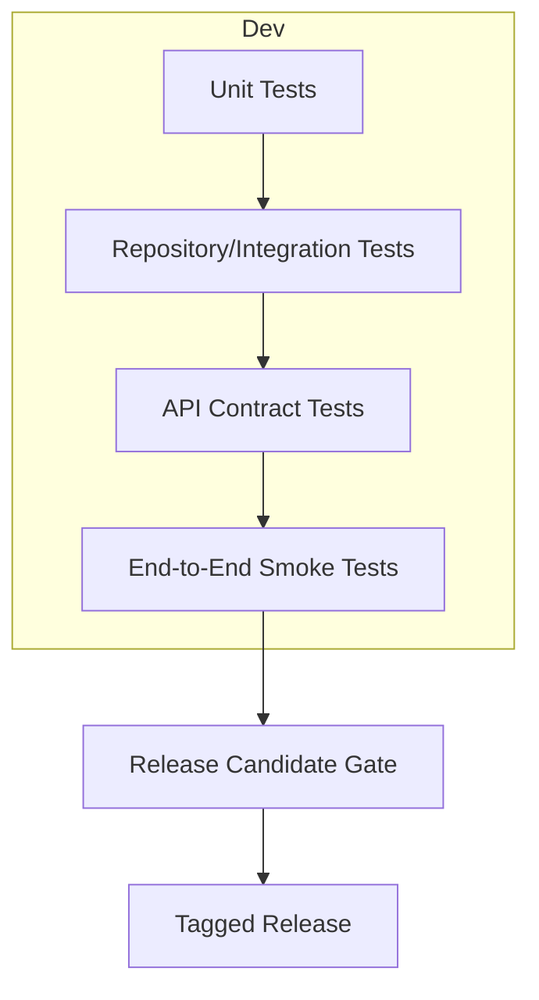
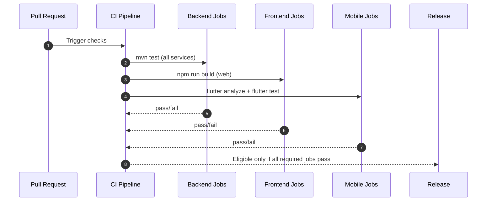

# Test Strategy

## Current Automated Checks
- Backend service build+tests (Maven):
  - `backend/auth-service`
  - `backend/portfolio-service`
  - `backend/simulation-service`
  - `backend/gateway`
- Web production build (Angular):
  - `frontend/web` via `npm run build`

## Recommended Test Layers
1. **Unit tests** for service-level business logic and validators.
2. **Repository tests** for user+org scoped query behavior.
3. **API contract tests** for critical workflows:
   - Auth + MFA
   - SSO callback handling
   - SCIM provisioning operations
   - Trade proposal/execution lifecycle
   - Auto-invest runs/fees/minimum balance checks
4. **End-to-end smoke tests** through gateway using Docker stack.

## Test Pyramid and Release Gate

## Org Security Regression Matrix
- Verify all org-scoped endpoints reject cross-org access.
- Verify admin endpoints require org admin/owner roles.
- Verify audit outputs remain tenant-scoped.

## Mobile/Web Validation
- Ensure key screens can load and submit against authenticated APIs.
- Keep route-to-endpoint coverage checklist synchronized with new modules.

## CI Recommendation
- Run Maven tests and Angular build on every PR.
- Add mobile static checks (`flutter analyze`, `flutter test`) where Flutter SDK is available.

## CI Pipeline Flow

