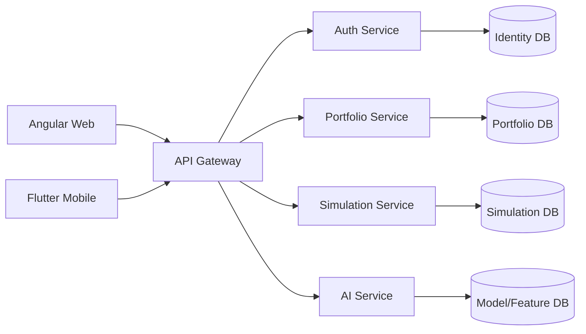
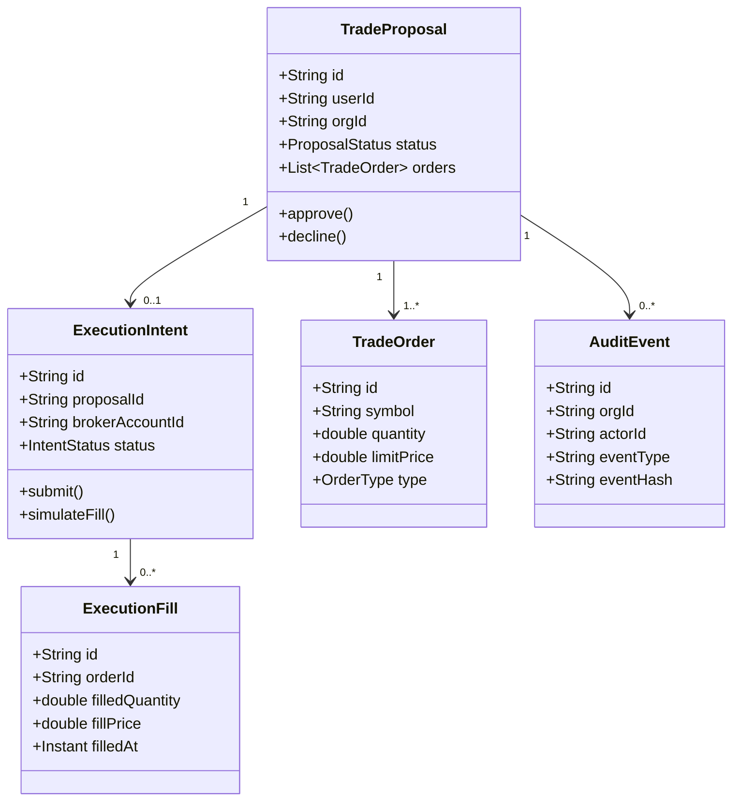
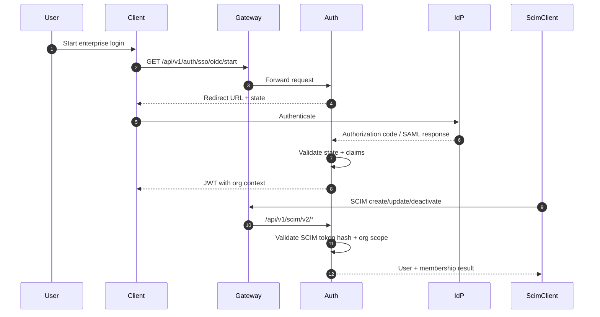
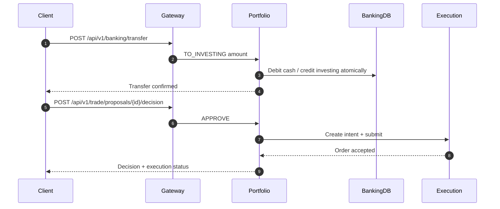

# UML Views

## 1. Component View

```mermaid
flowchart LR
  WEB["Angular Web"] --> GW["API Gateway"]
  MOB["Flutter Mobile"] --> GW
  GW --> AUTH["Auth Service"]
  GW --> PORT["Portfolio Service"]
  GW --> SIM["Simulation Service"]
  GW --> AI["AI Service"]
  AUTH --> AUTHDB[("Identity DB")]
  PORT --> PORTDB[("Portfolio DB")]
  SIM --> SIMDB[("Simulation DB")]
  AI --> AIDB[("Model/Feature DB")]
```

## 2. Core Domain Class View (Trading)

```mermaid
classDiagram
  class TradeProposal {
    +String id
    +String userId
    +String orgId
    +ProposalStatus status
    +List~TradeOrder~ orders
    +approve()
    +decline()
  }

  class ExecutionIntent {
    +String id
    +String proposalId
    +String brokerAccountId
    +IntentStatus status
    +submit()
    +simulateFill()
  }

  class TradeOrder {
    +String id
    +String symbol
    +double quantity
    +double limitPrice
    +OrderType type
  }

  class ExecutionFill {
    +String id
    +String orderId
    +double filledQuantity
    +double fillPrice
    +Instant filledAt
  }

  class AuditEvent {
    +String id
    +String orgId
    +String actorId
    +String eventType
    +String eventHash
  }

  TradeProposal "1" --> "1..*" TradeOrder
  TradeProposal "1" --> "0..1" ExecutionIntent
  ExecutionIntent "1" --> "0..*" ExecutionFill
  TradeProposal "1" --> "0..*" AuditEvent
```

## 3. Sequence View: SSO + SCIM Provisioning

```mermaid
sequenceDiagram
  autonumber
  participant User
  participant Client
  participant Gateway
  participant Auth
  participant IdP
  participant ScimClient

  User->>Client: Start enterprise login
  Client->>Gateway: GET /api/v1/auth/sso/oidc/start
  Gateway->>Auth: Forward request
  Auth-->>Client: Redirect URL + state
  Client->>IdP: Authenticate
  IdP-->>Auth: Authorization code / SAML response
  Auth->>Auth: Validate state + claims
  Auth-->>Client: JWT with org context

  ScimClient->>Gateway: SCIM create/update/deactivate
  Gateway->>Auth: /api/v1/scim/v2/*
  Auth->>Auth: Validate SCIM token hash + org scope
  Auth-->>ScimClient: User + membership result
```

## 4. Sequence View: Instant Bank Transfer + Trade

```mermaid
sequenceDiagram
  autonumber
  participant Client
  participant Gateway
  participant Portfolio
  participant BankingDB
  participant Execution

  Client->>Gateway: POST /api/v1/banking/transfer
  Gateway->>Portfolio: TO_INVESTING amount
  Portfolio->>BankingDB: Debit cash / credit investing atomically
  Portfolio-->>Client: Transfer confirmed

  Client->>Gateway: POST /api/v1/trade/proposals/{id}/decision
  Gateway->>Portfolio: APPROVE
  Portfolio->>Execution: Create intent + submit
  Execution-->>Portfolio: Order accepted
  Portfolio-->>Client: Decision + execution status
```
